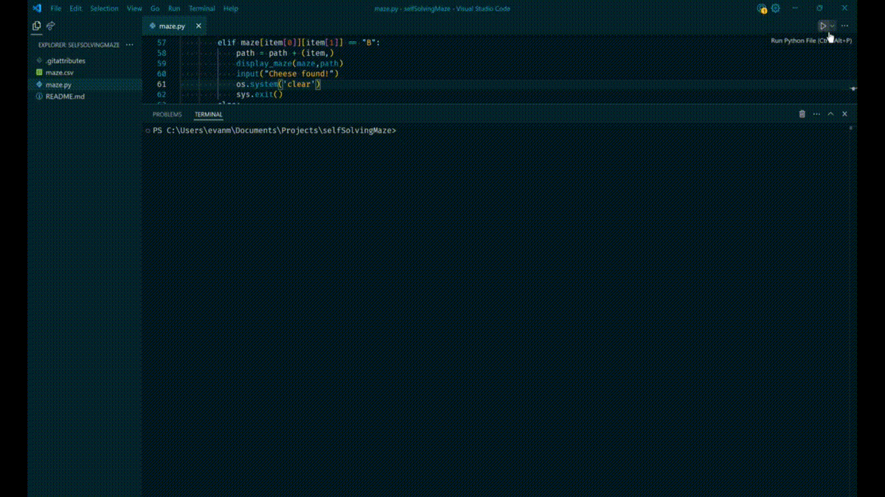

# Maze Solver

This script utilizes a recursive algorithm to navigate and solve mazes represented in a CSV file format. The maze solver finds the path from the start to the goal, visualizing the process in real-time.



## Features

- **Recursive Algorithm**: Uses a depth-first search approach to explore and solve mazes.
- **Real-Time Visualization**: Displays the maze and the path taken using colored symbols.
- **Maze Representation**: Reads mazes from a CSV file, where `0` represents an open cell, `1` represents walls, `A` is the starting point, and `B` is the goal.

## Technologies Used

- **Python 3.11** for scripting
- **CSV** for maze input
- **OS** and **Sys** for terminal operations
- **Time** for controlling the animation speed

## Installation

1. Clone the repository:

   ```bash
   git clone https://github.com/evanmaus/maze-solver.git
   cd maze-solver
